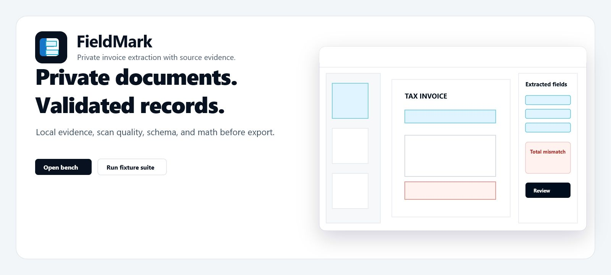
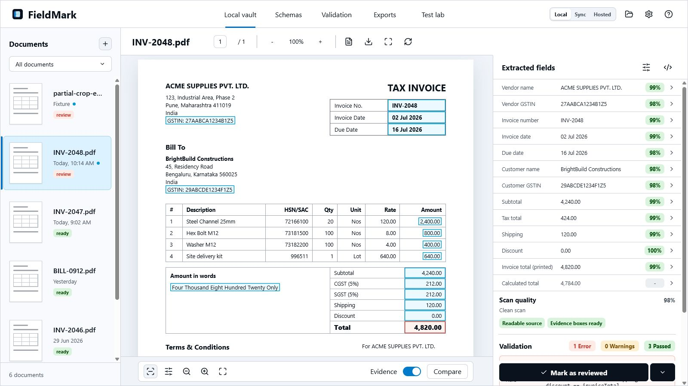
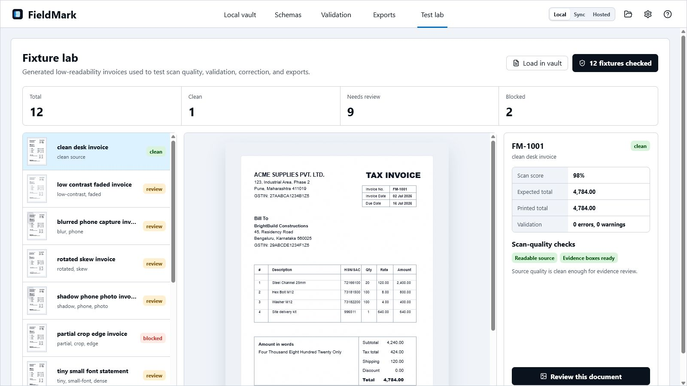
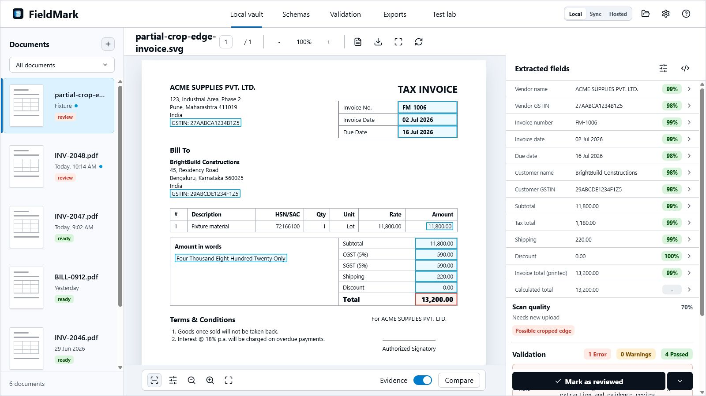
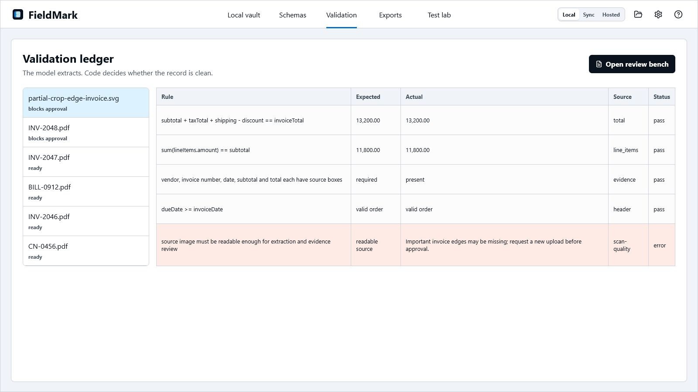

# FieldMark

<p align="center">
  
</p>

FieldMark is a local-first document extraction and validation workstation for invoices and business records. It keeps documents private by default, links every extracted field to visible source evidence, checks scan quality, verifies invoice math, and exports approved records as JSON or CSV.

## Demo

<video src="docs/media/fieldmark-demo.mp4" controls width="100%"></video>

Fallback video: [fieldmark-demo.webm](docs/media/fieldmark-demo.webm)

## Product Screens

| Review bench | Fixture lab |
| --- | --- |
|  |  |

| Blocked fixture review | Validation ledger |
| --- | --- |
|  |  |

## What Exists

- Local vault review bench with document queue, PDF-style viewer, source evidence highlights, editable extracted fields, scan-quality checks, and sticky approval actions.
- Browser-local OCR for uploaded PDFs and images using Tesseract.js with a vendored English language model in `public/tessdata`.
- Deterministic invoice validation for totals, line-item sums, required evidence, due-date order, and scan-quality blockers.
- Schema workspace for field paths, aliases, data kinds, evidence requirements, and schema suggestions.
- Validation ledger across all documents.
- Export workspace with local JSON and CSV generation.
- Fixture lab with 12 generated low-readability invoice images: clean, low contrast, blur, rotation, camera shadow, crop, tiny text, handwritten adjustment, dense tables, and mismatched totals.
- Local fixture loader that pushes any generated bad scan into the real review bench.
- Responsive desktop/mobile layouts.
- Brand assets, README banner, screenshots, and demo video.

## Run Locally

```bash
pnpm install
pnpm dev
```

Open `http://127.0.0.1:5174`.

## Verify Everything

```bash
pnpm fixtures:generate
pnpm test:all
```

`pnpm test:all` runs:

- unit tests
- generated fixture tests
- TypeScript checking
- production Vite build

## Fixture Coverage

Fixtures live in `public/fixtures/invoices` and are regenerated by:

```bash
pnpm fixtures:generate
```

The generator also writes `src/generatedFixtures.ts`, which powers the in-app Fixture lab. Tests verify the same generated images/manifests that the app displays.

## Project Structure

```text
src/
  App.tsx                product UI
  domain.ts             invoice, validation, scan-quality, export logic
  localExtraction.ts    browser-local OCR, PDF rendering, invoice text parsing
  fixtureDocuments.ts   fixture-to-document conversion and suite summary
  generatedFixtures.ts  generated fixture catalog
  *.test.ts             validation and fixture coverage
public/
  brand/                logo, mark, banner SVGs
  fixtures/invoices/    generated test invoices and manifests
  tessdata/             vendored English OCR language data
docs/
  media/                README banner, screenshots, demo video
  qa/                   browser QA captures
```

## Production Boundary

FieldMark's production code currently ships the local-first review workflow, browser-local OCR intake, schema/validation/export surfaces, scan-quality checks, fixture lab, deterministic document validation, generated test materials, and demo media.

The extraction adapter is intentionally isolated from validation. The current browser adapter runs Tesseract.js locally for English OCR and maps text into evidence-linked invoice JSON. A future native adapter can swap in PaddleOCR, Apple Vision, or a local VLM for stronger layout understanding without rewriting validation or exports.

## Privacy Modes

- `Local`: documents stay on this device.
- `Sync`: encrypted sync posture for a future private sync service.
- `Hosted`: explicit fallback posture for teams that opt into hosted processing later.

The UI makes the mode visible so users never confuse local processing with hosted review.
